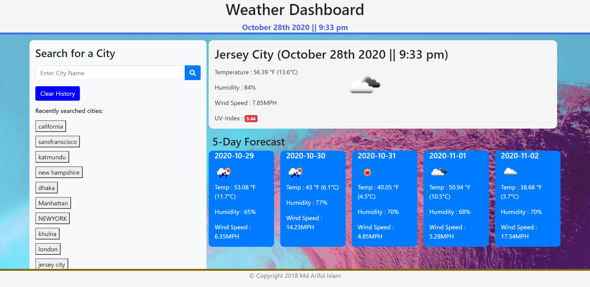

# weatherdashboard
 Here is a simple weather app. The App is stablished with 'Open weather' API.

#### How its works:
- On left side of the app You can search the city that you want see the weather info.
- If you select the city and hit seacrh button you can see:
- On Right-
- The city's Temparature ,Humidity, Wind speed and uv index
- And down there, the app show the 5 days forecast.
- All the function works perfectly.

# Here you can check:
[weatherDash](https://islam4049.github.io/weatherdash/)

#### App Look like:

